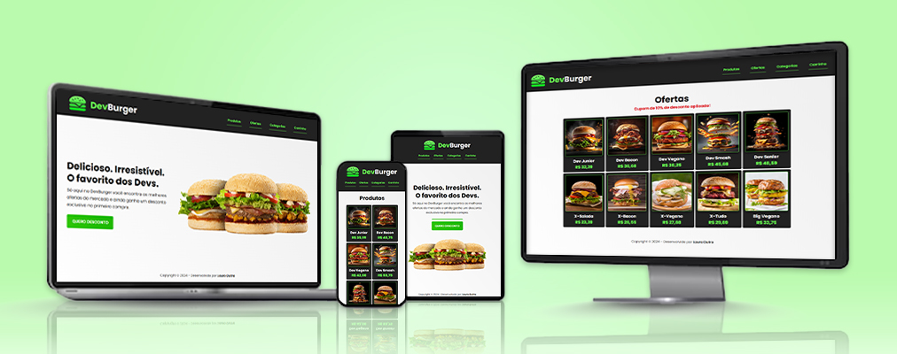

<h1>DEV BURGER</h1>

## 📝 Sobre

O projeto <b>DevBurger</b> apresenta uma hamburgueria fictícia que possui uma variedade de produtos, permitindo a aplicação de um cupom de desconto e a soma de todos os itens do carrinho. O projeto foi planejado para desktops e dispositivos móveis de diversos tamanhos, apresentando um design responsivo que se adapta à tela do usuário.

## ⚙ Funcionalidades

Para exibir a lista de produtos, clique no botão <i>Produtos</i> ou clique em <i>Ofertas</i> para obter a lista com um cupom de 10% de desconto já aplicado. O botão <i>Quero desconto</i>, na página inicial, exibe a mesma lista de ofertas com o desconto aplicado. Em <i>Categorias</i>, é possível filtrar os produtos por categoria e exibi-los na tela. Para saber o valor da soma de todos os itens, clique no botão <i>Carrinho</i>.

## 🤝🏻 Agradecimentos

Agradeço ao <a href="https://www.github.com/rodolfomori">Rodolfo Mori</a>, mentor do DevClub, pelos conhecimentos que obtive para codificação e inovação do projeto. 

## 🖥 Tecnologias

Este projeto foi desenvolvido com HTML, CSS e JavaScript.
